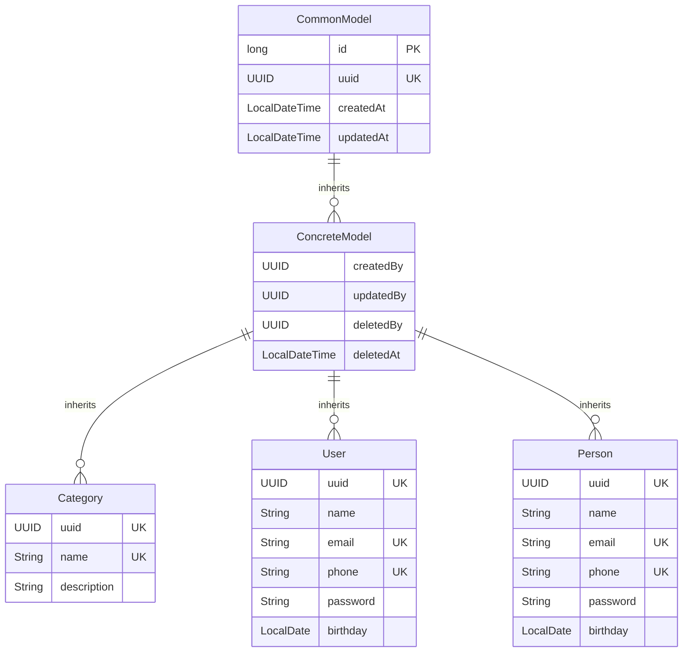

```mermaid
erDiagram
    CommonModel {
        long id PK
        UUID uuid UK
        LocalDateTime createdAt
        LocalDateTime updatedAt
    }

    ConcreteModel {
        UUID createdBy
        UUID updatedBy
        UUID deletedBy
        LocalDateTime deletedAt
    }

    CommonModel ||--o{ ConcreteModel : inherits

    Category {
        UUID uuid UK
        String name UK
        String description
    }

    ConcreteModel ||--o{ Category : inherits

    User {
        UUID uuid UK
        String name
        String email UK
        String phone UK
        String password
        LocalDate birthday
    }

    ConcreteModel ||--o{ User : inherits

    Person {
        UUID uuid UK
        String name
        String email UK
        String phone UK
        String password
        LocalDate birthday
    }

    ConcreteModel ||--o{ Person : inherits
```
