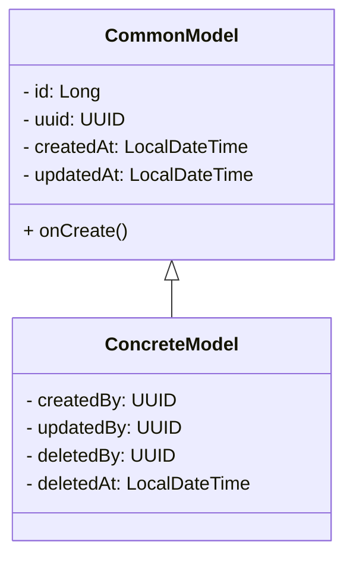

```mermaid
classDiagram
    class CommonModel {
        - id: Long
        - uuid: UUID
        - createdAt: LocalDateTime
        - updatedAt: LocalDateTime
        + onCreate()
    }

    class ConcreteModel {
        - createdBy: UUID
        - updatedBy: UUID
        - deletedBy: UUID
        - deletedAt: LocalDateTime
    }

    CommonModel <|-- ConcreteModel
```
