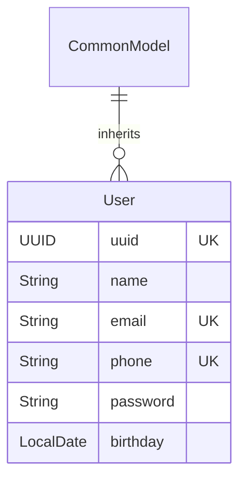
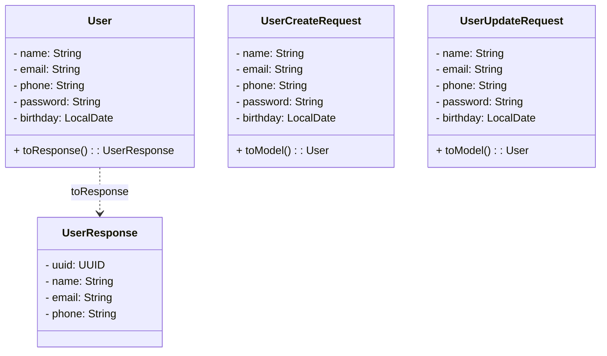

```mermaid
erDiagram
    CommonModel ||--o{ User : inherits

    User {
        UUID uuid UK
        String name
        String email UK
        String phone UK
        String password
        LocalDate birthday
    }
```

```mermaid
classDiagram
    class User {
        - name: String
        - email: String
        - phone: String
        - password: String
        - birthday: LocalDate
        + toResponse(): UserResponse
    }

    class UserResponse {
        - uuid: UUID
        - name: String
        - email: String
        - phone: String
    }

    class UserCreateRequest {
        - name: String
        - email: String
        - phone: String
        - password: String
        - birthday: LocalDate
        + toModel(): User
    }

    class UserUpdateRequest {
        - name: String
        - email: String
        - phone: String
        - password: String
        - birthday: LocalDate
        + toModel(): User
    }

    User ..> UserResponse : toResponse
```
